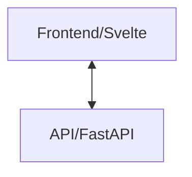

## Clinician Toolkit Orchestrator

This is the orchestrator for the clinician toolkit. It is responsible for
calling all services in the toolkit to locally deploy the toolkit.

At present, the software architecture looks as follows:



All services are pulled from other repositories within the CMI-DAIR organization. See each individual repository for more information.

## Deployment

Before deploying, copy `.env.example` to `.env` and fill in the required environment variables. Next run:

```bash
docker compose up
```

The frontend will then be accessible on port 3000, and the API at 8000.

Please note, that the summarization currently only accepts .docx files. These
docx files MUST have :

- A paragraph that contains solely "Name: [FIRST NAME] [LAST NAME]
- Headers that are (case-insensitive) equal to "clinical summary and impression", "mental health assessment", "dsm-5 diagnostic summary".

All text underneath these headers is extracted.
