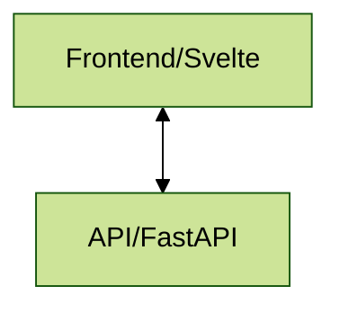

## Clinician Toolkit Orchestrator

This is the orchestrator for the clinician toolkit. It is responsible for
calling all services in the toolkit to locally deploy the toolkit.

At present, the software architecture looks as follows:



All services are pulled from other repositories within the CMI-DAIR organization. See each individual repository for more information.

## Deployment

To deploy, simply navigate to the root of the repository and run:

```bash
docker compose up
```

The frontend will then be accessible on port 3000, and the API at 8000.
