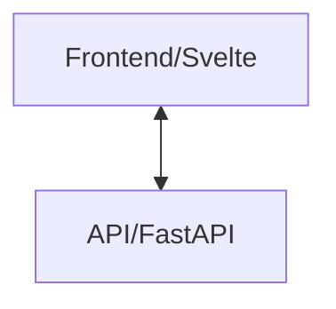

## Clinician Toolkit Orchestrator

This is the orchestrator for the clinician toolkit. It is responsible for
calling all services in the toolkit to locally deploy the toolkit.

At present, the software architecture looks as follows:



All services are pulled from other repositories within the CMI-DAIR organization. See each individual repository for more information.

## Deployment

First, make sure [Docker](https://docs.docker.com/get-docker/) is installed on your system. [Login to the ghcr.io repository](https://docs.github.com/en/packages/working-with-a-github-packages-registry/working-with-the-container-registry#authenticating-to-the-container-registry) to make sure you can pull the requisite images. Next, copy `.env.example` to `.env` and fill in the required environment variables. Lastly, run:

```bash
docker compose up
```

The frontend will then be accessible on port 3000, and the API at 8000.

## Usage

The summarization currently only accepts .docx files. These
docx files MUST have :

- A paragraph that contains solely "Name: [FIRST NAME] [LAST NAME]
- Headers that are (case-insensitive) equal to "clinical summary and impression", "mental health assessment", "dsm-5 diagnostic summary".

All text underneath these headers is extracted. A minimal example follows. Note that "Clinical Summary and Impression" must be a Heading.

```word
Name: Lea Avatar
Clinical Summary and Impression
Her name is Lea Avatar. She says that he said that it belongs to her.
```

Due to protections built into Google Chrome, it is currently not possible for a
local frontend to communicate with a local API in Chrome.
